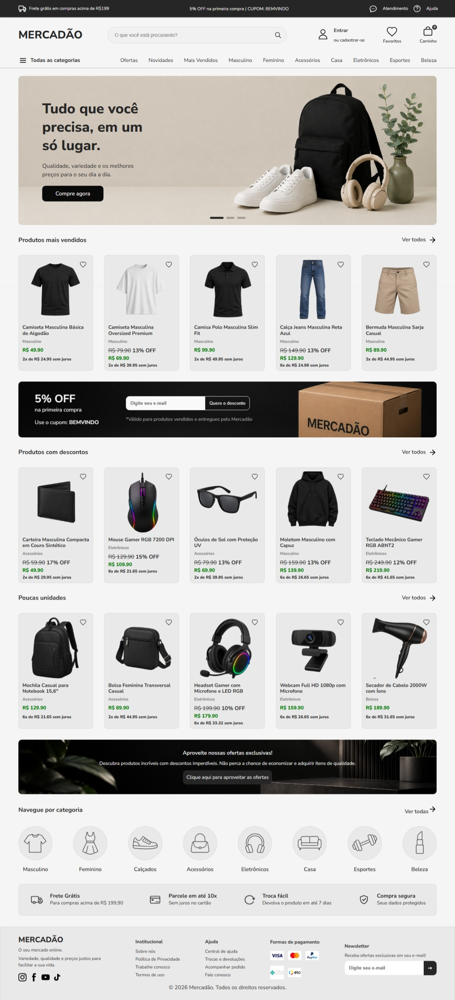

# Mercadão

## 📸 Preview

Um projeto de e-commerce desenvolvido com foco em utilizar os conceitos de Engenharia de Software, priorizando a organização, escalabilidade e boas práticas de desenvolvimento.

> 🚧 Projeto em desenvolvimento.

---

## 📖 Sobre

O mercadão é um projeto que eu criei para evoluir técnicas e conhecimentos em desenvolvimento web e na engenharia de software.

O meu objetivo não é apenas fazer uma interface de e-commerce, mas desenvolver uma aplicação completa, utilizando organização, que vai me ajudar na expansão de novas coisas no projeto atual.

---

## 🎯 Objetivos

- Desenvolver uma aplicação escalável.
- Aplicar HTML semântico.
- Organizar o CSS em componentes independentes.
- Manter um código limpo e de fácil manutenção.
- Evoluir o projeto para uma aplicação Full Stack.

---

## ✨ Funcionalidades atuais

- Header completo
  - Faixa superior com informações e suporte
  - Barra de pesquisa
  - Área da conta do usuário
  - Favoritos
  - Carrinho de compras
  - Menu de navegação principal
  - Navegação por categorias

- Banner principal

- Seção de categorias

- Produtos em destaque
  - Exibição dos produtos mais vendidos
  - Cards de produtos reutilizáveis
  - Botão de favoritos
  - Exibição de preço normal e promocional
  - Cálculo automático do percentual de desconto
  - Cálculo de parcelamento
  - Carregamento das imagens dos produtos

- Ofertas
  - Seleção dos produtos com maior percentual de desconto
  - Evita repetição de produtos já exibidos em outras seções

- Produtos com estoque baixo
  - Identificação de produtos com estoque reduzido
  - Evita repetição com produtos em destaque e ofertas

- Integração com backend
  - Consumo de produtos através de API REST
  - Dados carregados dinamicamente do PostgreSQL

- Organização modular
  - Componentes React separados por responsabilidade
  - Componente reutilizável para cards de produtos
  - Estilos CSS organizados por seção/componente

---

## 🚀 Próximas funcionalidades

### Interface (Front-end)

- [x] Adicionar seção de benefícios (frete, garantia e segurança)
- [x] Desenvolver o rodapé
- [x] Implementar animações e transições na interface
- [ ] Melhorar a responsividade para diferentes dispositivos

### Funcionalidades

- [ ] Slider funcional no banner
- [ ] Barra de pesquisa dinâmica
- [ ] Sistema de favoritos
- [ ] Carrinho de compras
- [ ] Navegação entre páginas da aplicação

### Páginas

- [ ] Página de produtos
- [ ] Página de detalhes do produto
- [ ] Página de favoritos
- [ ] Página do carrinho
- [ ] Página de login e cadastro
- [ ] Página de perfil do usuário

### Back-end

- [x] Desenvolvimento de uma API REST
- [ ] Sistema de autenticação de usuários
- [x] Gerenciamento de produtos
- [ ] Gerenciamento de pedidos
- [ ] Validação de dados
- [ ] Tratamento de erros

### Banco de Dados

- [x] Modelagem do banco de dados
- [ ] Cadastro de usuários
- [x] Cadastro de produtos
- [x] Categorias
- [ ] Favoritos
- [ ] Carrinho persistente
- [ ] Histórico de pedidos

### Qualidade de Software

- [ ] Melhorar a acessibilidade da aplicação
- [x] Padronizar o código seguindo boas práticas
- [x] Organizar a arquitetura do projeto
- [ ] Otimizar o desempenho da aplicação
- [ ] Documentar a API

---

## 🛠 Tecnologias

### Front-end

- HTML5
- CSS3
- JavaScript
- React.js
  
### Back-end

- Node.js
- Express.js
- REST API

### Banco de Dados

- PostgreSQL

### Ferramentas

- Git
- GitHub
- Visual Studio Code
- Vite
- npm
  
---

## 📂 Organização do projeto

- Estrutura modular, separando páginas, componentes, serviços e estilos.
- Componentes React organizados por responsabilidade, facilitando reutilização e manutenção.
- CSS separado por componentes e seções, evitando concentração excessiva de estilos em um único arquivo.
- Separação entre front-end e back-end, mantendo responsabilidades bem definidas.
- Comunicação com o back-end realizada por meio de uma API REST.
- Estrutura preparada para facilitar a adição de novas funcionalidades e seções ao projeto.
- Organização pensada para facilitar manutenção, escalabilidade e evolução do código.

---

## 📌 Objetivo de aprendizado

Este projeto faz parte dos meus estudos em Engenharia de Software e continuará recebendo melhorias conforme avanço nos estudos, incluindo arquitetura de backend, banco de dados e integração entre cliente e servidor.
