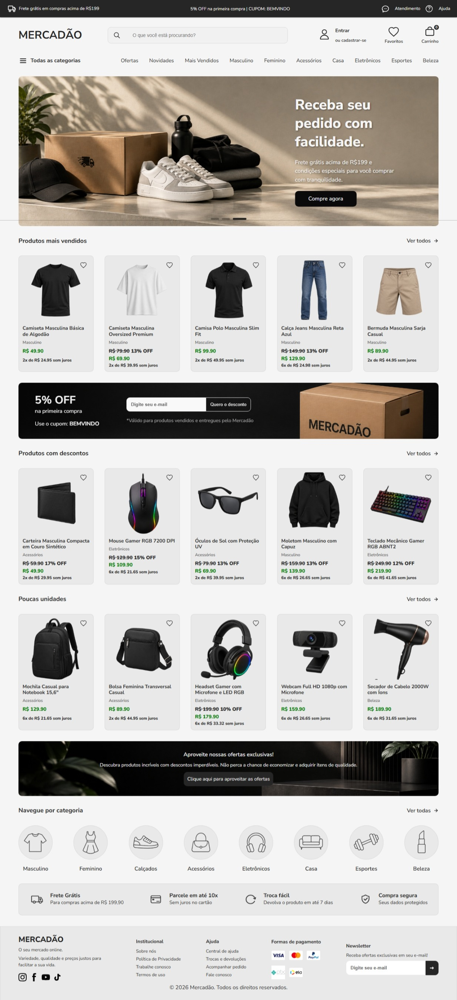

# Mercadão

## 📸 Desktop Preview

## 📸 Mobile Preview

Um projeto de e-commerce desenvolvido com foco na aplicação de conceitos de Engenharia de Software, buscando organização, escalabilidade, reutilização de componentes e boas práticas de desenvolvimento.

> 🚧 Projeto em desenvolvimento.

---

## 📖 Sobre

O Mercadão é um projeto desenvolvido para aprimorar meus conhecimentos em desenvolvimento web e Engenharia de Software.

A proposta vai além da criação de uma interface de e-commerce. O projeto está sendo desenvolvido como uma aplicação completa, com front-end, back-end e banco de dados, mantendo uma estrutura organizada para facilitar a manutenção e a implementação de novas funcionalidades.

---

## 🎯 Objetivos

- Desenvolver uma aplicação escalável e organizada.
- Aplicar HTML semântico.
- Utilizar componentes reutilizáveis.
- Organizar os estilos por responsabilidade.
- Manter um código limpo e de fácil manutenção.
- Desenvolver uma aplicação Full Stack.
- Aplicar conceitos de Engenharia de Software durante o desenvolvimento.

---

## ✨ Funcionalidades atuais

### Interface

- Header completo
  - Faixa superior com informações e suporte
  - Barra de pesquisa
  - Área da conta do usuário
  - Favoritos
  - Carrinho de compras
  - Menu de navegação principal
  - Navegação por categorias
  - Menu mobile

- Interface responsiva para dispositivos móveis

- Banner principal
  - Slider funcional
  - Indicadores de navegação
  - Navegação por toque em dispositivos móveis

- Seção de categorias

- Seção de benefícios

- Produtos em destaque
  - Exibição dos produtos mais vendidos
  - Cards de produtos reutilizáveis
  - Botão de favoritos
  - Exibição de preço normal e promocional
  - Cálculo automático do percentual de desconto
  - Cálculo de parcelamento
  - Carregamento das imagens dos produtos

- Ofertas
  - Seleção dos produtos com maior percentual de desconto
  - Evita repetição de produtos já exibidos em outras seções

- Produtos com estoque baixo
  - Identificação de produtos com estoque reduzido
  - Evita repetição com produtos em destaque e ofertas

- Rodapé

- Animações e transições da interface

### Integração

- Consumo de produtos através de API REST
- Dados carregados dinamicamente do PostgreSQL
- Separação entre front-end e back-end

### Organização

- Componentes React separados por responsabilidade
- Componentes reutilizáveis
- Estilos organizados por seção e componente
- Estrutura modular para facilitar manutenção e expansão

---

## 🚀 Próximas funcionalidades

### Interface (Front-end)

- [x] Seção de benefícios
- [x] Rodapé
- [x] Animações e transições
- [x] Responsividade para dispositivos móveis
- [ ] Melhorar responsividade para diferentes tamanhos de tela

### Funcionalidades

- [x] Slider funcional no banner
- [ ] Barra de pesquisa dinâmica
- [ ] Sistema de favoritos
- [ ] Carrinho de compras
- [ ] Navegação entre páginas da aplicação

### Páginas

- [ ] Página de produtos
- [ ] Página de detalhes do produto
- [ ] Página de favoritos
- [ ] Página do carrinho
- [ ] Página de login e cadastro
- [ ] Página de perfil do usuário

### Back-end

- [x] Desenvolvimento de uma API REST
- [ ] Sistema de autenticação de usuários
- [x] Gerenciamento de produtos
- [ ] Gerenciamento de pedidos
- [ ] Validação de dados
- [ ] Tratamento de erros

### Banco de Dados

- [x] Modelagem do banco de dados
- [ ] Cadastro de usuários
- [x] Cadastro de produtos
- [x] Categorias
- [ ] Favoritos
- [ ] Carrinho persistente
- [ ] Histórico de pedidos

### Qualidade de Software

- [ ] Melhorar a acessibilidade da aplicação
- [x] Padronizar o código seguindo boas práticas
- [x] Organizar a arquitetura do projeto
- [ ] Otimizar o desempenho da aplicação
- [ ] Documentar a API

---

## 🛠 Tecnologias

### Front-end

- HTML5
- SCSS
- JavaScript
- React.js
- Vite

### Back-end

- Node.js
- Express.js
- REST API

### Banco de Dados

- PostgreSQL

### Ferramentas

- Git
- GitHub
- Visual Studio Code
- npm

---

## 📂 Organização do projeto

O projeto possui uma estrutura modular, separando responsabilidades entre páginas, componentes, serviços, estilos, back-end e banco de dados.

- Componentes React organizados por responsabilidade.
- Componentes reutilizáveis para elementos da interface.
- Estilos SCSS separados por componentes e seções.
- Front-end e back-end mantidos em estruturas separadas.
- Comunicação entre cliente e servidor através de uma API REST.
- PostgreSQL utilizado para persistência dos dados.
- Estrutura preparada para facilitar a implementação de novas funcionalidades.

---

## 📌 Objetivo de aprendizado

Este projeto faz parte dos meus estudos em Engenharia de Software e continua em desenvolvimento conforme avanço nos estudos.

O objetivo é utilizar o projeto como um ambiente prático para aplicar conceitos de desenvolvimento web, arquitetura de software, banco de dados, APIs, responsividade, organização de código e integração entre diferentes partes de uma aplicação.
